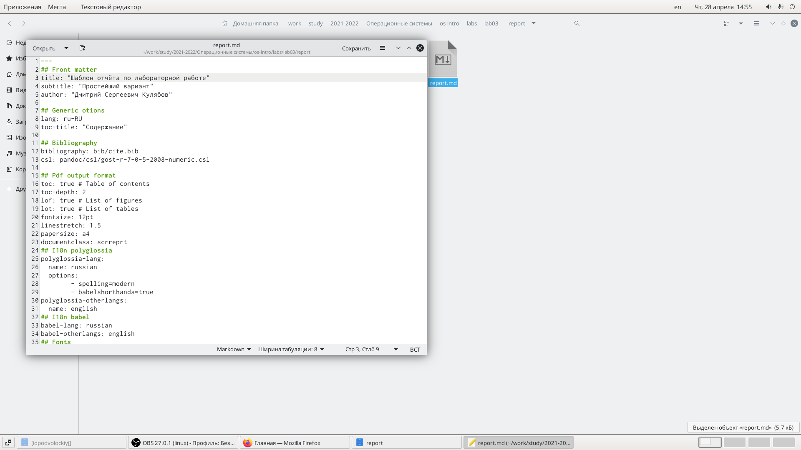
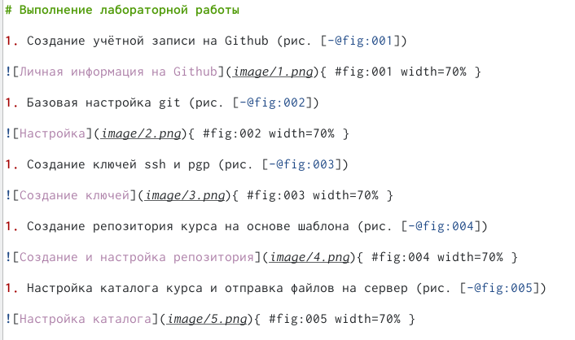
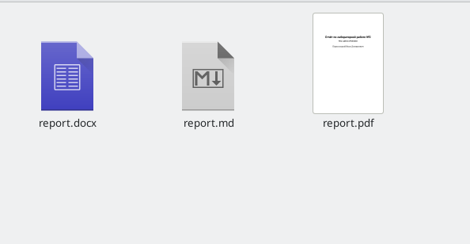

---
## Front matter
lang: ru-RU
title: Отчёт по лабораторной работе №3
author: |
	Ivan D. Podvolotskiy\inst{1,3}
institute: |
	\inst{1}RUDN University, Moscow, Russian Federation

## Formatting
toc: false
slide_level: 2
theme: metropolis
header-includes: 
 - \metroset{progressbar=frametitle,sectionpage=progressbar,numbering=fraction}
 - '\makeatletter'
 - '\beamer@ignorenonframefalse'
 - '\makeatother'
aspectratio: 43
section-titles: true
---

## Цель работы
 - Научиться оформлять отчёты с помощью легковесного языка разметки Markdown.
 
## Выполнение лабораторной работы

1. Открываем шаблон работы в Markdown для последующего редактированя

{ #fig:001 width=70% }

## Выполнение лабораторной работы

1. Непосредственно редакируем шаблом под тему второй лабороторной работы

{ #fig:002 width=70% }

## Выполнение лабораторной работы

1. Прописываем команду make в консоли и ждём компиляции файла

{ #fig:003 width=70% }

## {.standout}

Вывод: в ходе выполнения данной лабораторной работы я научился оформлять отчёты с помощью легковесного языка разметки Markdown.
